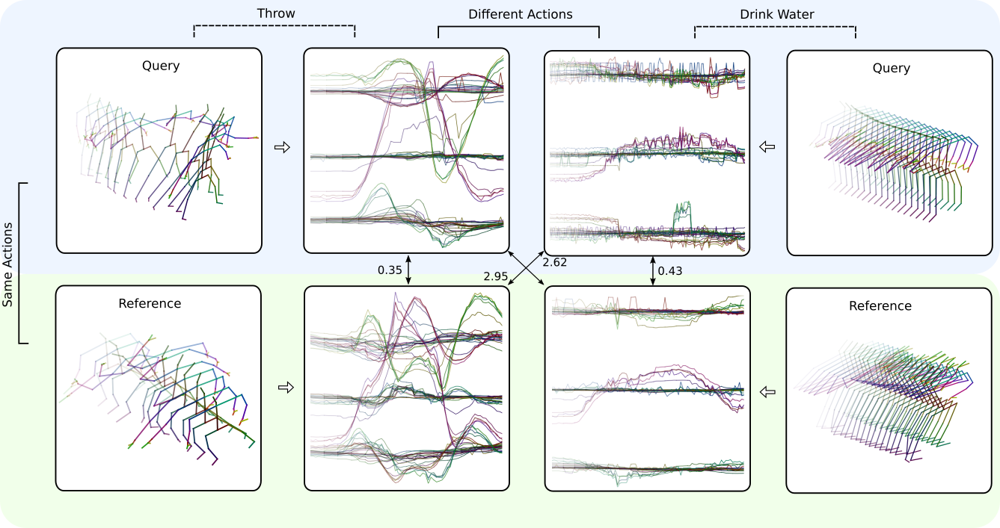
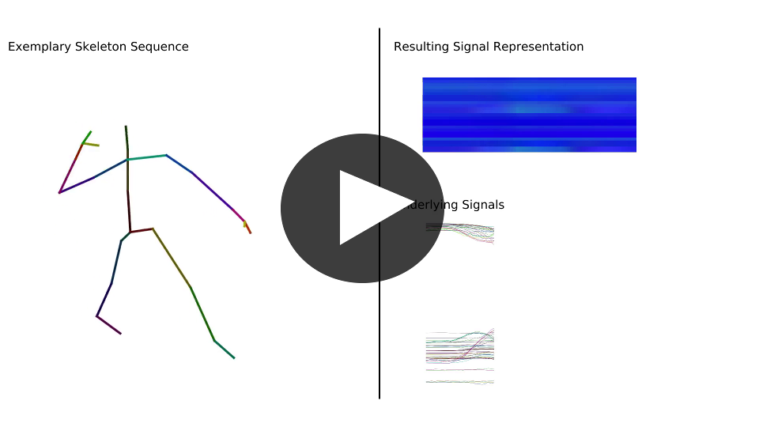

# SL-DML: Signal Level Deep Metric Learning for Multimodal One-Shot Action Recognition



This repository contains the code for SL-DML, a metric learning approach for one-shot action recognition supporting multiple modalities. A pre-print can be found on [arxiv](https://arxiv.org/pdf/2004.11085.pdf).

## Video Abstract


[](https://youtu.be/Wdy_YPPiYgc)

[Video](https://userpages.uni-koblenz.de/~raphael/videos/sl-dml.mp4)

## Citation

```
@article{memmesheimer2020signal,
  title={Signal Level Deep Metric Learning for Multimodal One-Shot Action Recognition},
  author={Memmesheimer, Raphael and Theisen, Nick and Paulus, Dietrich},
  journal={arXiv preprint arXiv:2004.11085},
  year={2020}
}
```

## Requirements

* `pip install -r requirements.txt`
*  SL-DML is based on the [pytorch-metric-learning](https://github.com/KevinMusgrave/pytorch-metric-learning) library

## Precalculated Representations

We provide precalculated representations for all conducted experiment splits:

* [NTU RGB+D 120 One-Shot](https://agas.uni-koblenz.de/datasets/sl-dml/ntu_120_one_shot.zip)
* [UTD-MHAD](https://agas.uni-koblenz.de/datasets/sl-dml/utdmhad_one_shot.zip)
* [Simitate](https://agas.uni-koblenz.de/datasets/sl-dml/simitate_one_shot.zip) 

## Quick Start


```
git clone https://github.com/raphaelmemmesheimer/sl-dml
cd sl-dml
pip install -r requirements.txt
export DATASET_FOLDER="$(pwd)/data"
mkdir -p data/ntu/
wget https://agas.uni-koblenz.de/datasets/sl-dml/ntu_120_one_shot.zip
unzip ntu_120_one_shot.zip -d $DATASET_FOLDER/ntu/ntu_swap_axes_testswapaxes
python train.py dataset=ntu_swap_axis
```
when returning you have to set the dataset folder again:

```
export DATASET_FOLDER="$(pwd)/data"
python train.py dataset=ntu_swap_axis
```

## Training

Note, the following commands require an environment variable `$DATASET_FOLDER` to be existing.

### NTU 120 One-Shot

Training for the NTU 120 one-shot action recognition experiments can be executed like:

`python train.py dataset=ntu_swap_axis`

During development, we suggest using the classes `A002, A008, A014, A020, A026, A032, A038, A044, A050, A056, A062, A068, A074, A080, A086, A092, A098, A104, A110,  A116` as validation classes.

### Simitate One-Shot

```
wget https://agas.uni-koblenz.de/datasets/sl-dml/simitate_one_shot.zip
mkdir -p data/simitate/
unzip simitate_one_shot.zip -d $DATASET_FOLDER/simitate/
```

to train then:
```
python train.py dataset=simitate_aux_010_val_004
```

You can run all experiments on the Simitate dataset as:

`python train.py dataset=simitate_aux_010_val_004,simitate_aux_010_val_016,simitate_aux_014_val_004,simitate_aux_014_val_012,simitate_aux_018_val_004,simitate_aux_018_val_008,simitate_aux_022_val_004 -m`
